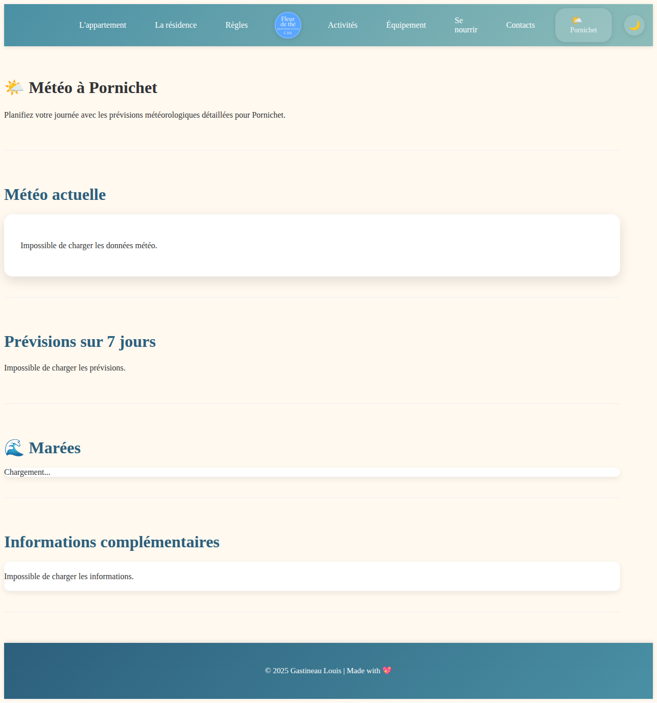

# Appartement Pornichet - Fleur de thé 🏖️

A beautiful apartment rental website for a comfortable stay in Pornichet, France - just 10 minutes from the beach!

## About

This website showcases **"Fleur de thé"** (C301), a charming apartment rental located in Pornichet, a seaside resort town in the Loire-Atlantique region of France. The website provides comprehensive information for potential guests about the apartment, residence, local activities, restaurants, and important rules for a pleasant stay.

## Features

- **🏠 Apartment Information**: Detailed information about the apartment amenities and features
- **🏘️ Residence Details**: Information about the residential complex and shared facilities
- **📋 House Rules**: Important guidelines for guests including noise regulations and plant watering etiquette
- **🎨 Activities**: Local activities, attractions, POIs, museums, sports rentals, and sea windmill visits
- **🛒 Equipment**: Nearby commerces and services (shops, bakeries, markets, pharmacies)
- **🍽️ Se nourrir**: Restaurants, bakeries, and markets with embedded Google My Maps
- **🗺️ Interactive Map**: Google My Maps integration showing recommended restaurants, activities, and food locations
- **🌤️ Weather Widget**: Quick-access real-time weather display in the navigation bar using Open-Meteo API
- **☀️ Weather Page**: Dedicated page with comprehensive weather information including current conditions, 7-day forecast, marine/tide conditions, wind, and humidity details
- **🌙 Dark Mode**: Toggle between light and dark themes with persistent preference storage
- **📞 Contact**: Easy ways to get in touch with the property owner

## Screenshots

### Homepage


The homepage welcomes visitors with a beautiful banner featuring Pornichet's beach and marina, along with the tagline "Bienvenue à Pornichet! - Votre séjour confortable à deux pas de la plage" (Welcome to Pornichet! - Your comfortable stay just steps from the beach).

Key features highlighted:
- 🏖️ Proximity to the beach (10 minutes walk)
- 🏡 Peaceful and secure residence
- 🚗 Ideal location near shops and restaurants

### Apartment Page


The apartment page provides detailed information about the rental property, including:
- **Apartment features** (🏠): Details about the 60m² apartment with 2 spacious bedrooms, equipped kitchen, and modern amenities
- **Equipment and services** (🛋️): Information about provided amenities like quality bedding, washing machine, private parking, and furnished balcony
- **Competitive rates** (💰): Seasonal pricing information
- **Fun Easter egg** (🚪): A playful hidden "secret room" feature for entertainment

### Activities Page


The activities page showcases local attractions and things to do in Pornichet:
- **Water activities and beaches** (🏖️): Information about the 3km of fine sand beaches, supervised swimming, sailing courses, and beach clubs
- **Discovery and culture** (🎨): Local markets, coastal trails, nearby attractions like La Baule and Brière Natural Park
- **Points of interest** (🗺️): Marina, beaches, Saint-Nazaire offshore wind farm, and local heritage sites
- **Sports equipment rental** (🏄): Information about bike, surfboard, kayak, and diving equipment rentals
- **Interactive map**: Google My Maps embed showing beaches, sports activities, restaurants, and points of interest with organized layers

### Weather Page


The dedicated weather page provides comprehensive meteorological information for Pornichet:
- **Current weather** (🌤️): Real-time temperature, conditions, and weather description
- **7-day forecast**: Extended weather predictions to help plan your stay
- **Tide information** (🌊): Marine conditions and tide schedules
- **Additional details**: Wind speed, humidity, and other meteorological data
- **Quick access**: Also available as a widget in the navigation bar on all pages

## Technology Stack

- **HTML5**: Semantic markup for the website structure
- **Bootstrap 5.3.3**: Responsive design framework for mobile-friendly layout
- **CSS3**: Custom styling with `style.css` featuring coastal theme with CSS variables for light/dark modes
- **JavaScript**: Vanilla JavaScript for interactive features
  - Bootstrap's JavaScript bundle for responsive components
  - Custom dark mode toggle (`dark-mode.js`) with localStorage persistence
  - Weather widget integration (`weather.js`)
- **Google My Maps**: Embedded interactive map (no API key required)
- **Open-Meteo API**: Free weather data (no API key required)
- **Open-Meteo Marine API**: Ocean/wave conditions and marine data

## How to View

Simply open `index.html` in a web browser to view the website. For development, you can use a local server:

```bash
# Using Python
python3 -m http.server 8000

# Using Node.js (http-server)
npx http-server -p 8000
```

Then navigate to `http://localhost:8000` in your browser.

### Using Google My Maps

The interactive maps on the Activities and Restaurants pages use Google My Maps embedded via iframe. This approach:
- **Requires no API key** - works immediately
- **Easy to update** - edit the map in Google My Maps and changes appear automatically
- **No usage limits** - completely free

See [GOOGLE_MAPS_SETUP.md](GOOGLE_MAPS_SETUP.md) for:
- How to edit the map content
- How to add new locations and markers
- How to organize map layers

## Pages

- **index.html** - Homepage with welcome message and highlights
- **appartement.html** - Apartment details and house rules
- **residence.html** - Information about the residential complex
- **regles.html** - Complete list of rules and regulations
- **activities.html** - Local activities, attractions, POIs, museums, and sports equipment rentals
- **equipement.html** - Commerces and services (shops, bakeries, markets, pharmacies)
- **se-nourrir.html** - Restaurants, bakeries, and markets with embedded Google My Maps
- **weather.html** - Detailed weather page with current conditions, 7-day forecast, marine conditions, and additional weather information
- **contact.html** - Contact information

## Branding

The website features the "Fleur de thé" brand with:
- Logo: A blue circular emblem with "Fleur de thé" text
- Apartment identifier: C301
- Tagline: "Appartement terrasse"

## Credits

© 2025 Gastineau Louis | Made with 💖

---

**Location**: Pornichet, Loire-Atlantique, France 🇫🇷
